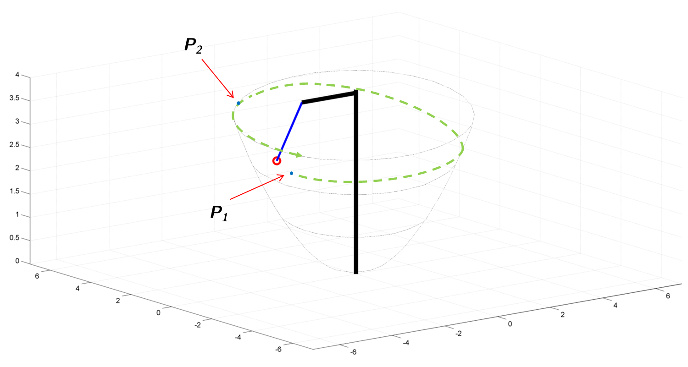

# Non Linear Model Predictive Control  and State Estimation of Tethered Flying Objects

# Motivation
Could it be possible to move a flying object over a predefined trajectory between two
points in the three-dimensional space? Former modelling attempts are taken into con-
sideration and the Lagrange formalism is applied in order to find a more appropriate
model for faster simulations and control. Its parameters are then estimated with several
optimisation routines. As usual, the model is linearised and discretised and a Discrete
Linear Quadratic Regulator is used to control the elevation angle of a ball as a response
to different kinds of input excitations at the carousel. A full state controller can be
achieved only after designing and implementing a Kalman filter. Both components are
then improved with the so called Internal Model Principle so that the elevation response
of the ball keeps as unchanged as possible. A Nonlinear Model Predictive Control is then
developed along with a Moving Horizon Estimator (state observer) and two nontrivial
optimal control problems are tested.

# Code
The code is separated in modular thematic checkpoints, for some of them (basically for modelling purposes) 
just Matlab implementations are available while for the ones needed for state estimation or 
predictive control real time C++ (OROCOS) versions are also attached. 

 ## Modelling section
 
